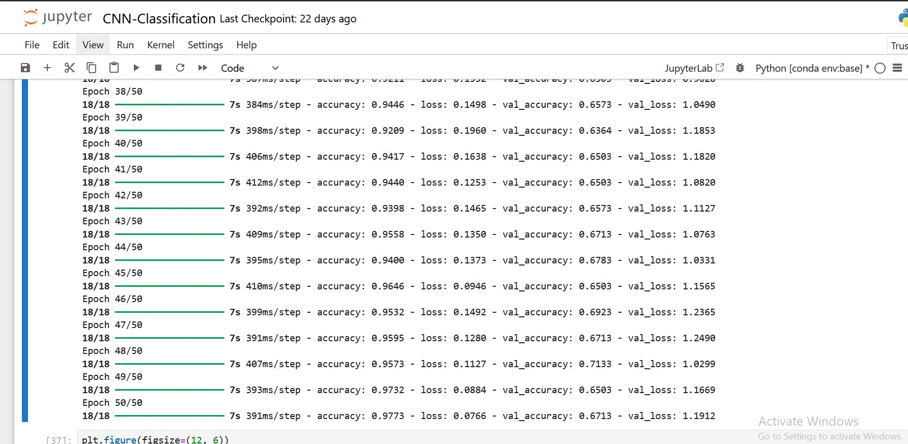
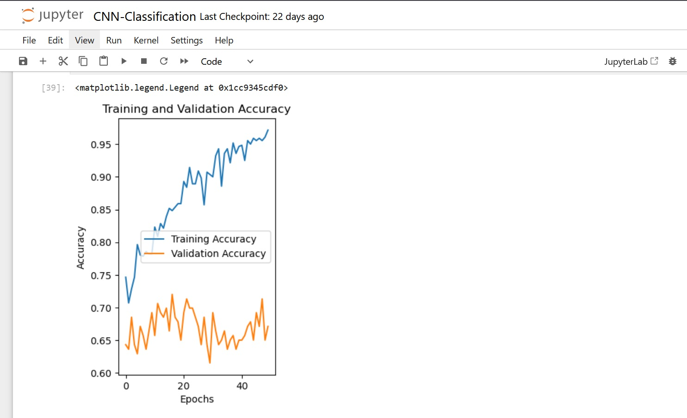
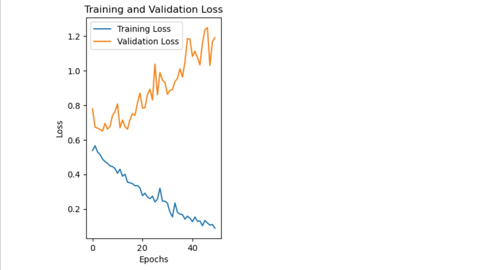

# Projet de Classification d'Images avec un CNN

## Description
Ce projet met en œuvre un modèle de réseau de neurones convolutifs (CNN) conçu pour classifier des images de chats et de chiens. Le but principal est de développer un algorithme capable de prédire si une image donnée représente un chat ou un chien.

### Points Clés :
- Utilisation d'un dataset provenant de Kaggle, contenant des images de chiens et de chats préalablement classifiées en ensembles d'entraînement et de test.
- Exploration d'un modèle CNN de base avec ajustements progressifs pour améliorer la performance.
- Évaluation basée sur la précision et la perte sur les ensembles d'entraînement et de test.

---

## Structure du Projet

- **Code principal** : [CNN-Classification.ipynb](./CNN-Classification.ipynb)  
- **Données** : Dataset disponible sur [Kaggle](#) ([https://www.kaggle.com/datasets/samuelcortinhas/cats-and-dogs-image-classification/data]).  

---

## Expériences
1. **Architecture** :  
   - Plusieurs couches convolutives suivies de couches de pooling.
   - Couche dense finale avec une fonction d'activation Sigmoïde pour la classification binaire.
2. **Paramètres** :
   - Fonction de perte : `binary_crossentropy`  
   - Optimiseur : `Adam`  
   - Nombre d'époques : 50
   - Taille de batch : 32
3. **Résultats** :  
   - Précision de l'entraînement raisonnable, mais faible précision sur les données de test, révélant un problème de surajustement.

### Ajustements apportés :
- Augmentation du nombre d'époques pour permettre au modèle d'apprendre davantage.
- Introduction de régularisations comme le Dropout pour réduire le surajustement.
- Tests avec différentes tailles de filtres et profondeurs dans les couches convolutives.
### Quelque Captures d'ecran : 
---

